# API Styles Comparison

This document illustrates the architectural differences and data flow patterns between common API styles: REST, SOAP, GraphQL, gRPC, Webhooks, WebSocket, and WebRTC.

## Interaction Patterns

```mermaid
graph TD
    %% Styling Classes
    classDef client fill:#e3f2fd,stroke:#1565c0,stroke-width:2px;
    classDef server fill:#e8f5e9,stroke:#2e7d32,stroke-width:2px;
    classDef protocol fill:#fff3e0,stroke:#ef6c00,stroke-width:2px,stroke-dasharray: 5 5;

    %% 1. Request / Response (Standard)
    subgraph S1 [Standard Request-Response]
        direction TB
        subgraph REST_Flow [REST / SOAP / GraphQL]
            R_Client(Client):::client
            R_Server(Server):::server
            
            R_Client -- "1. Request (HTTP)" --> R_Server
            R_Server -- "2. Response (JSON/XML)" --> R_Client
        end
    end

    %% 2. gRPC (High Performance)
    subgraph S2 [gRPC / RPC]
        direction TB
        subgraph GRPC_Flow [gRPC]
            G_Client(Client Stub):::client
            G_Server(Server Stub):::server
            
            G_Client -- "1. Proto Request (Binary)" --> G_Server
            G_Server -- "2. Proto Response" --> G_Client
            G_Client -.->|Streaming Supported| G_Server
        end
    end

    %% 3. Webhooks (Event Driven)
    subgraph S3 [Event Driven / Push]
        direction TB
        subgraph Webhook_Flow [Webhooks]
            WH_Source(Event Source):::server
            WH_Receiver(Receiver / Client):::client
            
            WH_Source -- "Event Occurs! (Push)" --> WH_Receiver
            WH_Receiver -.->|Ack 200 OK| WH_Source
        end
    end

    %% 4. WebSocket (Bidirectional)
    subgraph S4 [Bidirectional / Persistent]
        direction TB
        subgraph WS_Flow [WebSocket]
            WS_Client(Client):::client
            WS_Server(Server):::server
            
            WS_Client <== "Open Connection (Handshake)" ==> WS_Server
            WS_Client <-->|Full Duplex Data| WS_Server
        end
    end

    %% 5. WebRTC (Peer-to-Peer)
    subgraph S5 [Peer-to-Peer]
        direction TB
        subgraph RTC_Flow [WebRTC]
            PeerA(Peer A):::client
            PeerB(Peer B):::client
            Signal(Signaling Server):::server
            
            PeerA -.->|Session Info SDP| Signal
            Signal -.->|Session Info SDP| PeerB
            PeerA <== 'Direct P2P Media/Data' ==> PeerB
        end
    end

```

## Key Differences

| API Style | Communication | Data Format | Use Case |
| :--- | :--- | :--- | :--- |
| **REST** | Stateless Request/Response | JSON, XML, HTML | Standard web APIs, public services. |
| **SOAP** | Stateless Request/Response | XML (Strict) | Enterprise, banking, legacy systems requiring strict standards. |
| **GraphQL** | Stateless Query/Response | JSON | Flexible data fetching, mobile apps, complex relational data. |
| **gRPC** | RPC (Contract-based) | Protobuf (Binary) | Microservices, internal systems, high performance, streaming. |
| **Webhooks** | Event-Driven (Push) | JSON (usually) | Asynchronous notifications (e.g., "Payment Received"), system syncing. |
| **WebSocket** | Stateful (Bidirectional) | Binary / Text | Chat apps, live dashboards, gaming, real-time updates. |
| **WebRTC** | Peer-to-Peer | RTP / Binary | Video conferencing, voice calls, large file transfer between users. |