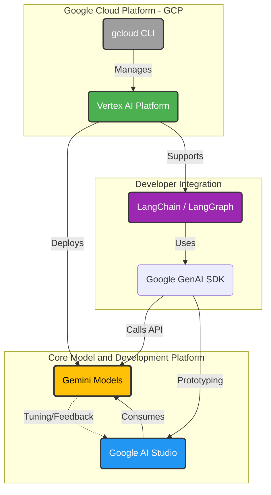

# Architecture Overview

This document provides a visual overview of the system architecture, illustrating how the core models, development platforms, and Google Cloud environment interact.

## System Components & Data Flow

